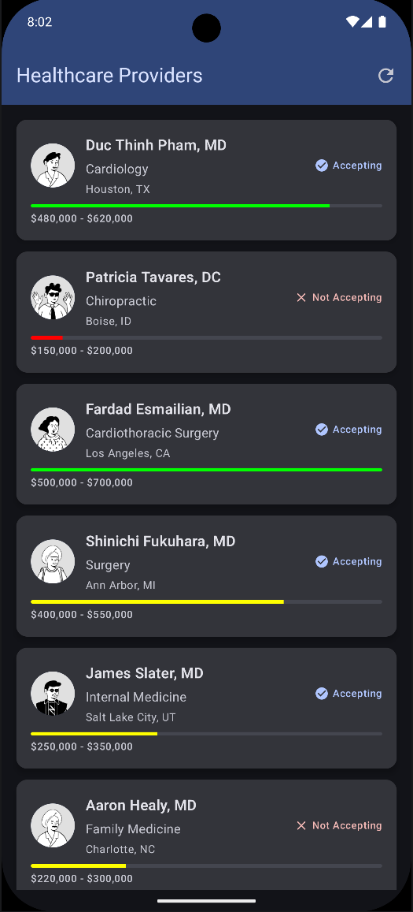

## Overview
MedDirectory demonstrates modern Android architecture patterns with Clean Architecture, MVVM, and reactive programming using Kotlin Coroutines

## Features

### Core Features
- **Feed Screen**: Browse medical professionals with avatar, specialty, location, and salary
- **Detail Screen**: View complete profile with salary statistics and visual comparisons
- **Smart Caching**: LRU cache (100 items) for offline support and instant navigation
- **Generic UI State**: Single `UiState<T>` pattern for all screens

### Technical Highlights
- **Optimized Repository**: Clean separation of concerns with flat, readable code structure
- **Error Handling**: Network, server, and not-found errors with retry functionality

## Tech Stack

### Core Technologies
- **Kotlin**
- **Jetpack Compose**
- **Coroutines and StateFlow**
- **Reactive state management**

### Architecture & DI
- **Clean Architecture** (Domain, Data, Presentation layers)
- **MVVM Pattern**
- **Hilt** for dependency injection
- **Repository Pattern** with cache abstraction
- **Sealed Classes** for error handling and UI states

### Networking & Data
- **Retrofit**
- **OkHttp** for HTTP client
- **Coil 3** for image loading
- **LruCache** for in-memory caching

### Navigation
- **Navigation Compose** with type-safe routes
- **ID-based navigation**

### Testing
- **JUnit 4**
- **MockK** 
- **Turbine** 
- **Coroutines Test**

## Architecture

### Data Layer
- **FeedApiService**: Retrofit interface for API calls
- **LruItemCache**: Android LruCache wrapper with interface for testability
- **FeedRepositoryImpl**: Repository with smart caching and ID-based lookup

### Domain Layer
- **FeedItem**: Domain model
- **FeedRepository**: Repository interface
- **GetFeedUseCase**: Use case for fetching feed
- **UiState**: Generic sealed class for UI states

### Presentation Layer
- **FeedScreen/DetailScreen**: Compose UI components
- **FeedViewModel/DetailViewModel**: State management with StateFlow
- **AppNavigation**: Type-safe navigation graph

## API

- **Base URL**: `https://mocki.io/v1/`
- **Endpoint**: `5bb09ab0-8d6d-4d85-8284-b6a467299353`

### Avatar Generation
- **Service**: DiceBear API
- **Style**: notionists
- **Seed**: Professional ID for consistency

## UI Components

### Feed Screen
- Professional cards with avatar, name, specialty, location
- Salary range with color-coded visual indicator
- "Accepting patients" status badge
- Pull-to-refresh support

### Detail Screen
- Large avatar and complete profile information
- Salary statistics with percentile visualization
- Back navigation with TopAppBar

## Error Handling
- Network errors with retry option
- Not found (404) handling
- Server errors (5xx) with user-friendly messages
- Loading states with progress indicators

## Preview data for composables
- Mocks for both composables
- in their isolated file to decouple from the main composable
